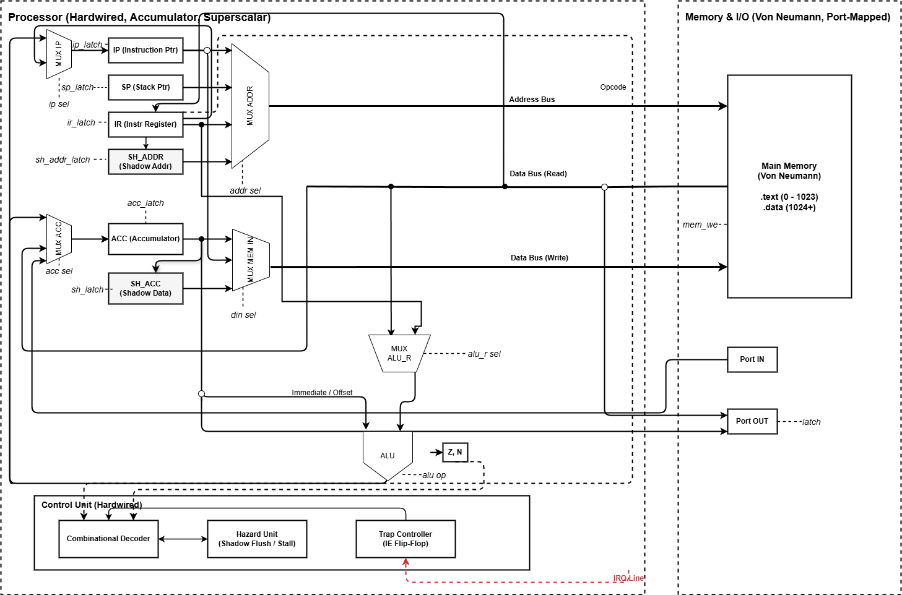
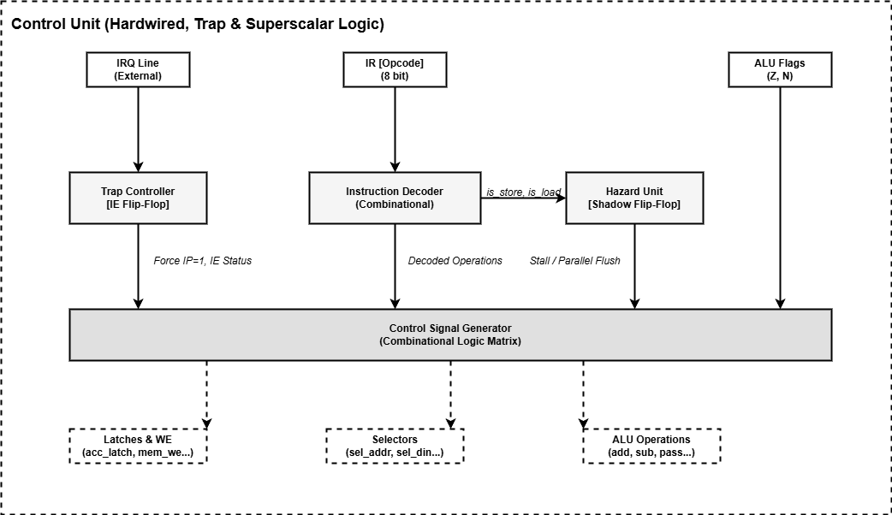

---

# Itmo-csa-lab4

- **Шукаев Олег Евгеньевич P3210**
- Вариант: `lisp | acc | neum | hw | tick | binary | trap | port | pstr | prob1 | superscalar`
  - `lisp`: Синтаксис языка Lisp. S-exp:
    1. Поддержка рекурсивных функций.
    2. Любое выражение - expression.
  - `acc`: Система команд выстроена вокруг аккумулятора.
  - `neum`: Фон Неймановская архитектура.
  - `hw`: Hardwired control unit.
  - `tick`: Процессор моделируется с точностью до такта.
  - `binary`: Бинарное представление машинного кода.
  - `trap`: Ввод-вывод осуществляется через систему прерываний.
  - `port`: Port-mapped.
  - `pstr`: Length-prefixed Pascal-строки.
  - `alg1`: Eluer problem 4 (палиндромы-произведения трёхзначных чисел) .
  - `superscalar`: Суперскалярная организация работы процессора.

---

## Язык программирования Lisp

Синтаксис основан на S-выражениях. Каждая конструкция записывается в виде списка в круглых скобках. Транслятор осуществляет построение AST для глубокого семантического анализа.

### Формальная грамматика

```ebnf
<program> ::= <expression>*

<expression> ::= <number> 
               | <string> 
               | <identifier> 
               | <list>

<list> ::= "(" <operator> <expression>* ")"

<operator> ::= "defvar" | "setq" | "defun" | "funcall" | "if" 
             | "print" | "print_str" | "print_char" | "in" | "defirq"
             | "+" | "-" | "mod" | "=" | "!=" | "<" | ">"

<identifier> ::= [a-zA-Z_][a-zA-Z0-9_]*
<number> ::= [-+]?[0-9]+
<string> ::= '"' [^"]* '"'
```

### Семантика
- **Statement = Expression:** Любая языковая конструкция, включая `if` и `setq`, вычисляется и оставляет результат в аккумуляторе. Это позволяет использовать их вложенно (например, `(print (if p 1 2))`).
- **Переменное число аргументов:** Бинарные операторы поддерживают левую свертку: `(+ 1 2 3)` аппаратно разворачивается в `(+ (+ 1 2) 3)` на этапе построения AST.
- **Типизация:** Динамическая / бестиповая. Все данные обрабатываются как 32-битные знаковые машинные слова.
- **Строки (`pstr`):** Реализованы как *Pascal Strings* (длина + символы). Выделяются статически в памяти данных.
- **Рекурсия и контекст:** Язык поддерживает честные рекурсивные вызовы. Локальный контекст математических выражений и параметров функций безопасно сохраняется в аппаратный стек (`PUSH`/`POP`), что исключает состояние гонки.
- **Tail Call Optimization (TCO):** Для предотвращения переполнения стека реализована оптимизация хвостовой рекурсии. Если рекурсивный вызов является строго последней операцией, транслятор разворачивает его в безусловный переход `JMP`.
- **Прерывания:** Обработчик прерываний задается блоком `(defirq ...)`.

---

## Организация памяти

Модель: **Архитектура фон Неймана**.
Тип памяти: Однопортовая. Размер: `16384` машинных слов.

```text
        Main Memory (16384 x 32 bit)
+-----------------------------------+
| 0x0000 : JMP 3                    | <-- Обход вектора прерывания
| 0x0001 : JMP isr                  | <-- Вектор прерывания (IRQ Vector)
| 0x0002 : NOP                      |
| 0x0003 : _start: instruction_1    | <-- .text (Скомпилированные инструкции)
|   ...                             |
| 0x0400 : variable_1 / string_len  | <-- .data (Переменные, темпы AST, строки)
|   ...                             |
| 0x3FFF : stack_bottom             | <-- Стек (растет вверх к 0x0400)
+-----------------------------------+
```

---

## Система команд (ISA)

Архитектура: **Аккумуляторная (1-адресная)**.
Машинный код (`binary`): Инструкции имеют фиксированный размер **32 бита (4 байта)**:
* `Opcode`: 8 бит (операция).
* `Operand`: 24 бита (знаковое целое число в формате Little-Endian).

| Мнемоника | Опкод | Такты | Описание |
|-----------|-------|-------|----------|
| `NOP`     | 0     | 1     | Пустая операция |
| `LD`      | 1     | 2     | `ACC ← M[arg]` |
| `LDI`     | 2     | 2     | `ACC ← arg` |
| `ST`      | 3     | 1*    | `M[arg] ← ACC` |
| `ADD`     | 4     | 2     | `ACC ← ACC + M[arg]` |
| `SUB`     | 5     | 2     | `ACC ← ACC - M[arg]` |
| `MOD`     | 6     | 2     | `ACC ← ACC % M[arg]` |
| `CMP`     | 7     | 2     | Установить флаги `Z` и `N` (`ACC - M[arg]`) |
| `JMP`     | 8     | 2     | Безусловный переход `IP ← arg` |
| `JZ/JNZ`  | 9/10  | 2     | Условные переходы по флагу Z |
| `JLT/JGT` | 21/22 | 2     | Условные переходы по флагам Z и N |
| `IN`      | 11    | 2     | `ACC ← IN[port]` |
| `OUT`     | 12    | 2     | `OUT[port] ← ACC` |
| `PUSH`    | 13    | 2     | `M[SP] ← ACC; SP ← SP - 1` |
| `POP`     | 14    | 2     | `SP ← SP + 1; ACC ← M[SP]` |
| `CALL`    | 15    | 2     | `M[SP] ← IP; SP ← SP - 1; IP ← arg` |
| `RET`     | 16    | 2     | `SP ← SP + 1; IP ← M[SP]` |
| `IRET`    | 17    | 2     | Восстановление контекста из стека, включение `IE` |
| `LD_PTR`  | 19    | 3**   | `ACC ← M[M[arg]]` |
| `ST_PTR`  | 20    | 2*    | `M[M[arg]] ← ACC` |
| `HLT`     | 18    | 1     | Остановка симулятора |

*\* Операции `ST/ST_PTR` физически завершаются в следующем такте (Parallel Flush) или генерируют Stall.*
*\*\* Косвенная адресация имеет штраф `+1 такт` (Stall) из-за физического ограничения однопортовой памяти.*

---

## Транслятор

```bash
python translator.py <source.lisp> <output.bin> [debug.txt]
```
Работает в два прохода, обеспечивая изоляцию парсинга и кодогенерации:
1. **Front-end:** Лексический анализ и построение AST. Раннее выявление `SyntaxError`.
2. **Back-end:** Обход дерева в глубину. Включает предварительную регистрацию функций, оптимизацию TCO и назначение уникальных временных переменных.
Результат — бинарный файл формата `<i` и дизассемблерный дамп `debug.txt`.

---

## Модель процессора

```bash
python machine.py <binary.bin> <schedule.json>
```

### DataPath (Тракт данных)
 

Тракт данных реализует аккумуляторную архитектуру с поддержкой суперскалярного исполнения. 

**Управляющие сигналы:**
* `acc_latch` — защёлкнуть результат в Аккумулятор.
* `ip_latch` — защёлкнуть новый адрес инструкции.
* `sp_latch` — защёлкнуть значение Stack Pointer (через выделенные инкрементатор/декрементатор, в обход АЛУ).
* `ir_latch` — защёлкнуть команду в регистр инструкций.
* `sh_acc_latch` — защёлкнуть данные в теневой регистр.
* `sh_addr_latch` — защёлкнуть адрес в теневой регистр.
* `mem_we` (Write Enable) — произвести физическую запись в ОЗУ.

**Управляющие сигналы (Селекторы / MUX Selectors):**
* `sel_addr` — выбор источника адреса для памяти: `IP` (Fetch), `SP` (Стек), `IR` (Прямая адресация), `SH_ADDR` (Parallel Flush).
* `sel_din` — выбор источника записи в память: `ACC`, `SH_ACC`, `IP` (для CALL).
* `sel_alu_r` — выбор правого входа АЛУ: `MEM` (переменная), `IR` (константа).
* `sel_acc` — выбор входа в аккумулятор: `ALU`, `MEM` (Прямой обход Bypass), `Port IN`.
* `sel_ip` — выбор входа в счетчик команд: `+1`, `IR` (Прыжок), `MEM` (Возврат из стека).

**АЛУ (Арифметико-логическое устройство):**
Способно выполнять операции `ADD`, `SUB`, `MOD`, а также `PASS_R` (сквозной пропуск правого операнда для загрузки констант). Генерирует флаги `Z` (Zero) и `N` (Negative).

---

### Control Unit (Устройство управления)


Тип: **Hardwired**. Отсутствует память микрокоманд и счетчик микрокоманд. Декодирование происходит комбинационной матрицей за 1 такт.

#### Механизм Суперскаляра (Hazard Unit & Deferred Store)
В аккумуляторной архитектуре классический суперскаляр невозможен из-за зависимости по данным. Использован паттерн теневого регистра:
1. При команде `ST x` процессор **откладывает** запись (`mem_we=0`). Адрес и данные аппаратно защёлкиваются в `SH_ACC` и `SH_ADDR`. Триггер Hazard-блока взводится. Затрачивается 1 такт.
2. Если следующая инструкция — `LD` или АЛУ (`ADD`), Hazard-блок генерирует **Parallel Flush**. В один такт физически сбрасывается теневой регистр в память и читается новый операнд.
3. При структурном конфликте (две записи подряд или ветвление) конвейер аппаратно замораживается на 1 такт для принудительного сброса тени.

#### Ввод-вывод и Прерывания (Trap Controller)
* Внешнее устройство асинхронно обновляет байтовый регистр `port_data` и выставляет аппаратную линию `IRQ Line`.
* При `IRQ=True` и триггере `IE=True` Control Unit перехватывает управление:
  1. Аппаратно сбрасывает флаг `IE`.
  2. За 4 такта сохраняет весь контекст в стек: `IP`, `ACC`, `Флаги (Z, N)`.
  3. Форсирует `IP = 1` (Вектор прерывания).
* В журнале такты прерывания помечаются маркером `[ISR]`. Инструкция `IRET` восстанавливает контекст, прозрачно возвращая процессор в прерванный цикл.

---

## Тестирование

Тестирование осуществляется с помощью `pytest` и плагина `pytest-golden`.
Запуск: `pytest -v` (или `pytest --update-goldens`).

### Список тестов:
1. `hello` — Вывод Pascal-строки из памяти.
2. `cat` — Посимвольное эхо через асинхронные прерывания `[ISR]`.
3. `hello_user_name` — Интерактивный диалог через `Trap`. Демонстрирует защиту контекста прерыванием (сохранение `ACC` и флагов во время работы основного цикла).
4. `double_precision` — Эмуляция 64-битной арифметики (ручной перенос разряда / Carry) на 32-битной архитектуре.
5. `alg1` — Задача эйлера № 4. Поиск самого большого палиндрома, образованного произведением двух трёхзначных чисел.
6. `expressions` — Синтетический тест вложенности "Statement as Expression".

### Пример работы суперскаляра и прерываний (из `hello_user_name.yml`)
В логе наглядно видно перехват контекста, отложенное сохранение и параллельный сброс:

```text
--- Simulation Trace ---  
Tick    1 | IP 0000 | JMP    3 | ACC=0  
Tick    2 | IP 0003 | LDI    0 | ACC=0  
Tick    3 | IP 0004 | ST     1024 | Deferred Store  
Tick    4 | IP 0005 | LDI    0 | ACC=0 | [Parallel Flush]  
Tick    5 | IP 0006 | ST     1025 | Deferred Store  
Tick    6 | IP 0007 | LDI    1026 | ACC=1026 | [Parallel Flush]  
Tick    7 | IP 0008 | OUT    2 | ACC=1026  
Tick    8 | IP 0009 | CALL   51 | ACC=1026  
Tick    9 | IP 0051 | LD     1024 | ACC=0  
Tick   10 | IP 0052 | PUSH   0 | ACC=0  
Tick   11 | IP 0053 | LDI    0 | ACC=0  
Tick   12 | IP 0054 | ST     1062 | Deferred Store  
Tick   13 | IP 0055 | POP    0 | ACC=0  
Tick   14 | IP 0056 | CMP    1062 | ACC=0 | [Parallel Flush]  
Tick   15 | IP 0057 | JZ     60 | ACC=0  
Tick   16 | IP 0060 | LDI    1 | ACC=1  
Tick   17 | IP 0061 | CMP    1049 | ACC=1  
Tick   18 | IP 0062 | JZ     65 | ACC=1  
Tick   19 | IP 0063 | JMP    51 | ACC=1  
Tick   20 | IP 0051 | LD     1024 | ACC=0  
Tick   21 | IP 0052 | PUSH   0 | ACC=0  
Tick   22 | IP 0053 | LDI    0 | ACC=0  
Tick   23 | IP 0054 | ST     1062 | Deferred Store  
Tick   24 | IP 0055 | POP    0 | ACC=0  
Tick   25 | IP 0056 | CMP    1062 | ACC=0 | [Parallel Flush]  
Tick   26 | IP 0057 | JZ     60 | ACC=0  
Tick   27 | IP 0060 | LDI    1 | ACC=1  
Tick   28 | IP 0061 | CMP    1049 | ACC=1  
Tick   29 | IP 0062 | JZ     65 | ACC=1  
Tick   30 | IP 0063 | JMP    51 | ACC=1  
Tick   31 | IP 0051 | LD     1024 | ACC=0  
Tick   32 | IP 0052 | PUSH   0 | ACC=0  
Tick   33 | IP 0053 | LDI    0 | ACC=0  
Tick   34 | IP 0054 | ST     1062 | Deferred Store  
Tick   35 | IP 0055 | POP    0 | ACC=0  
Tick   36 | IP 0056 | CMP    1062 | ACC=0 | [Parallel Flush]  
Tick   37 | IP 0057 | JZ     60 | ACC=0  
Tick   38 | IP 0060 | LDI    1 | ACC=1  
Tick   39 | IP 0061 | CMP    1049 | ACC=1  
Tick   40 | IP 0062 | JZ     65 | ACC=1  
Tick   41 | IP 0063 | JMP    51 | ACC=1  
Tick   42 | IP 0051 | LD     1024 | ACC=0  
Tick   43 | IP 0052 | PUSH   0 | ACC=0  
Tick   44 | IP 0053 | LDI    0 | ACC=0  
Tick   45 | IP 0054 | ST     1062 | Deferred Store  
T  
... [TRUNCATED LOG] ...  
 POP    0 | ACC=1050  
Tick  363 | [ISR] IP 0020 | CMP    1048 | ACC=1050 | [Parallel Flush]  
Tick  364 | [ISR] IP 0021 | JZ     24 | ACC=1050  
Tick  365 | [ISR] IP 0022 | LDI    0 | ACC=0  
Tick  366 | [ISR] IP 0023 | JMP    25 | ACC=0  
Tick  367 | [ISR] IP 0025 | CMP    1049 | ACC=0  
Tick  368 | [ISR] IP 0026 | JZ     31 | ACC=0  
Tick  369 | [ISR] IP 0031 | LDI    0 | ACC=0  
Tick  370 | [ISR] IP 0032 | LD     1047 | ACC=10  
Tick  371 | [ISR] IP 0033 | PUSH   0 | ACC=10  
Tick  372 | [ISR] IP 0034 | LDI    10 | ACC=10  
Tick  373 | [ISR] IP 0035 | ST     1058 | Deferred Store  
Tick  374 | [ISR] IP 0036 | POP    0 | ACC=10  
Tick  375 | [ISR] IP 0037 | CMP    1058 | ACC=10 | [Parallel Flush]  
Tick  376 | [ISR] IP 0038 | JZ     41 | ACC=10  
Tick  377 | [ISR] IP 0041 | LDI    1 | ACC=1  
Tick  378 | [ISR] IP 0042 | CMP    1049 | ACC=1  
Tick  379 | [ISR] IP 0043 | JZ     48 | ACC=1  
Tick  380 | [ISR] IP 0044 | LDI    1059 | ACC=1059  
Tick  381 | [ISR] IP 0045 | OUT    2 | ACC=1059  
Tick  382 | [ISR] IP 0046 | ST     1024 | Deferred Store  
Tick  384 | [ISR] IP 0047 | JMP    50 | ACC=1059  
Tick  385 | IP 0050 | IRET   0 | ACC=1  
Tick  386 | IP 0061 | CMP    1049 | ACC=1  
Tick  387 | IP 0062 | JZ     65 | ACC=1  
Tick  388 | IP 0063 | JMP    51 | ACC=1  
Tick  389 | IP 0051 | LD     1024 | ACC=1059  
Tick  390 | IP 0052 | PUSH   0 | ACC=1059  
Tick  391 | IP 0053 | LDI    0 | ACC=0  
Tick  392 | IP 0054 | ST     1062 | Deferred Store  
Tick  393 | IP 0055 | POP    0 | ACC=1059  
Tick  394 | IP 0056 | CMP    1062 | ACC=1059 | [Parallel Flush]  
Tick  395 | IP 0057 | JZ     60 | ACC=1059  
Tick  396 | IP 0058 | LDI    0 | ACC=0  
Tick  397 | IP 0059 | JMP    61 | ACC=0  
Tick  398 | IP 0061 | CMP    1049 | ACC=0  
Tick  399 | IP 0062 | JZ     65 | ACC=0  
Tick  400 | IP 0065 | LDI    0 | ACC=0  
Tick  401 | IP 0066 | RET    0 | ACC=0  
Tick  402 | IP 0010 | ST     1046 | Deferred Store  
Tick  403 | IP 0011 | LD     1046 | ACC=0 | [Parallel Flush]  
Tick  404 | IP 0012 | HLT    0 | ACC=0  
--- Output ---  
What is your name?  
Hello, Alice!
```

**CI Pipeline:** Настроен GitHub Actions. Выполняются: `ruff format`, `ruff check`, статический анализатор `mypy` и прогон Golden-тестов `pytest`. Отключение линтеров не используется.